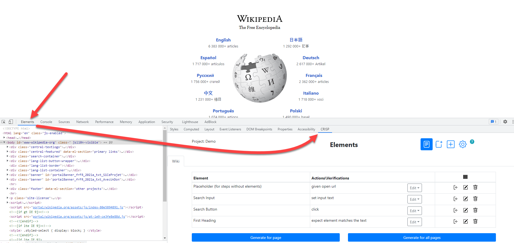

# CRISP overview

CRISP is an open-source Chrome extension which helps to select web elements on the page, automatically populate its selectors, assign configured actions and generate ready test code based on the customized patterns. It can speed up the process of test development by replacing manual time-consuming operations with automated features.
<br>
### CRISP configured to use [WebdriverIO Cucumber Boilerplate](https://github.com/webdriverio/cucumber-boilerplate#cucumber-boilerplate) project by default.
1. Follow the [quick start guide](https://github.com/webdriverio/cucumber-boilerplate#quick-start) to setup the WebdriverIO Cucumber Boilerplate project.
1. [Install](#Installation) and [use](#how-to-get-started) CRISP to generate test steps.
1. Add generated test steps to [new scenario](https://github.com/webdriverio/cucumber-boilerplate#how-to-write-a-test) in WebdriverIO Cucumber Boilerplate project.
1. [Run](https://github.com/webdriverio/cucumber-boilerplate#how-to-run-the-test) the test.


## Requirements
- [Node](https://nodejs.org/en/) version 12 or higher
## Installation

1. Download the latest stable release [here](https://github.com/exadel-inc/crisp/archive/refs/heads/master.zip) or clone the git repo: 
```
$ git clone https://github.com/exadel-inc/crisp.git
```
2. Navigate to the root folder and run the command to install the dependencies
```
$ npm install
```
3. Run the command to build the artifacts
```
$ npm run build
```
4. Launch Chrome browser and open the Extension Management page by navigating to `chrome://extensions`
5. Enable Developer Mode by clicking the toggle switch next to **Developer mode**.
6. Click the **Load unpacked** button and select the `dist` directory from CRISP files.


## How to get started

To start using CRISP:

1. Launch Chrome browser.
2. Open Developer tools:
- Click “Customize and control Google Chrome” (3-dots icon)  at the status bar -> Select “More Tools” -> select “Developer Tools”;
- Or press Ctrl+Shift+I;
- Or press F12 key.
3. Open “Elements” tab.
4. Open "CRISP" sub-tab on the same level with the "Styles" sub-tab.

5. Click [+] icon to open “Add element” screen.
6. Launch the “Inspect” tool and select the necessary element at the page. 
<br>_(As a result, CRISP will populate found locators of the element into the related fields “ID”, “CSS”, “xPath”_).
7. Select the necessary test “Actions\Verifications” for this element.
<br>_(e.g. “`click`” or “`expect element is displayed`”)_
8. Click [Save] button.
9. Open “Test Actions\Verifications” tab in the bottom.
10. Click “Generate for page” button and see results.
11. Copy & Paste the generated test steps into [new scenario](https://github.com/webdriverio/cucumber-boilerplate#how-to-write-a-test) in WebdriverIO Cucumber Boilerplate project and [run](https://github.com/webdriverio/cucumber-boilerplate#how-to-run-the-test) it


## Tips & Tricks
- Use  to generate test steps sequentially for different elements and create comprehensive E2E scenarios.
- [Create new pages](./docs/crisp-help.md#saved-pages) to store elements.
- [Add many elements at once](./docs/crisp-help.md#add-elements-in-bulk) based on a common attribute.
- Customize and define your own steps and patterns in the “Settings” -> [“Framework”](./docs/crisp-help.md#framework).

For more details please refer to the [CRISP manual](./docs/crisp-help.md).
_______

## Entryfiles (bundles)

There are two kinds of entryfiles that create bundles.

1. All ts-files in the root of the `./app/scripts` directory
2. All css-,scss- and less-files in the root of the `./app/styles` directory

_______
## Upcoming features

1. UI/UX redesign
2. Highlight elements
3. Verify locators of elements
4. User actions history
5. Presets for actions/verifications
6. User-friendly merge conflict resolution during Import/Pull/Push